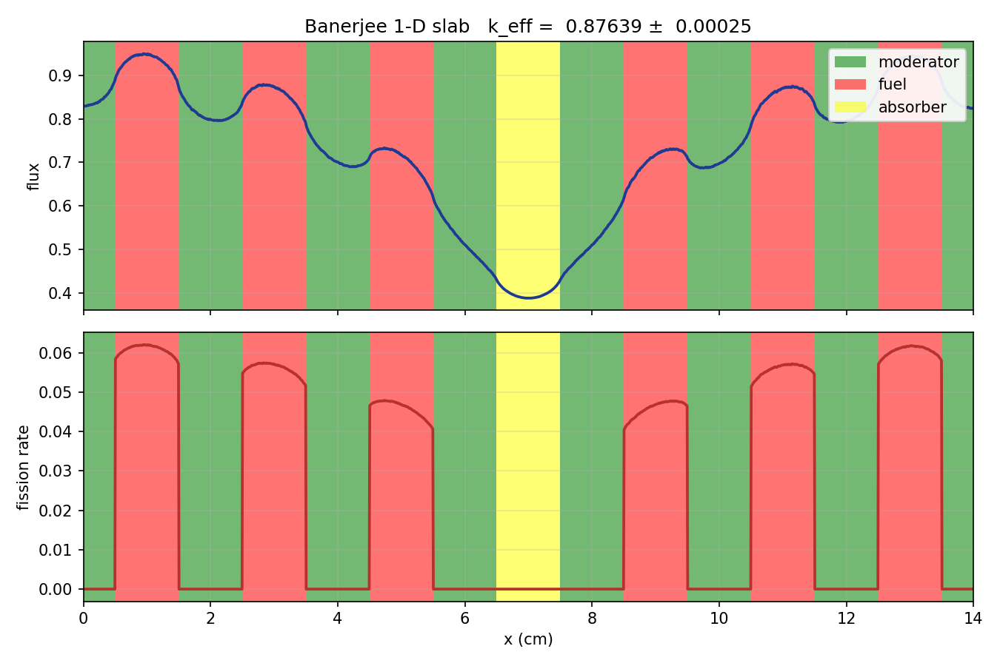

# Lumentite: OpenMC benchmark models for new FET methods

The main goal of this repository hold OpenMC models from already published journals realted to functional expansion tallies and use those to benchmark new functional expansion basis functions and methods, rather than making up random models everytime. 

It currently contains 
* 1D reactor physics model from Dr. Kaushik Banerjee's PhD [thesis](https://www.proquest.com/dissertations-theses/kernel-density-estimator-methods-monte-carlo/docview/275815580/se-2), "Kernel Density Estimator Methods for Monte Carlo Radiation Transport"

